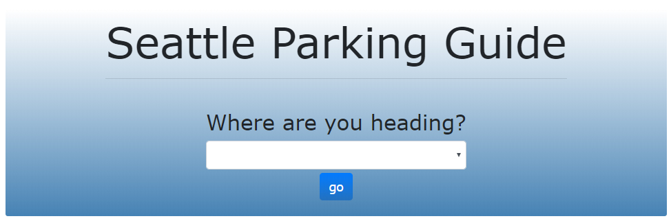
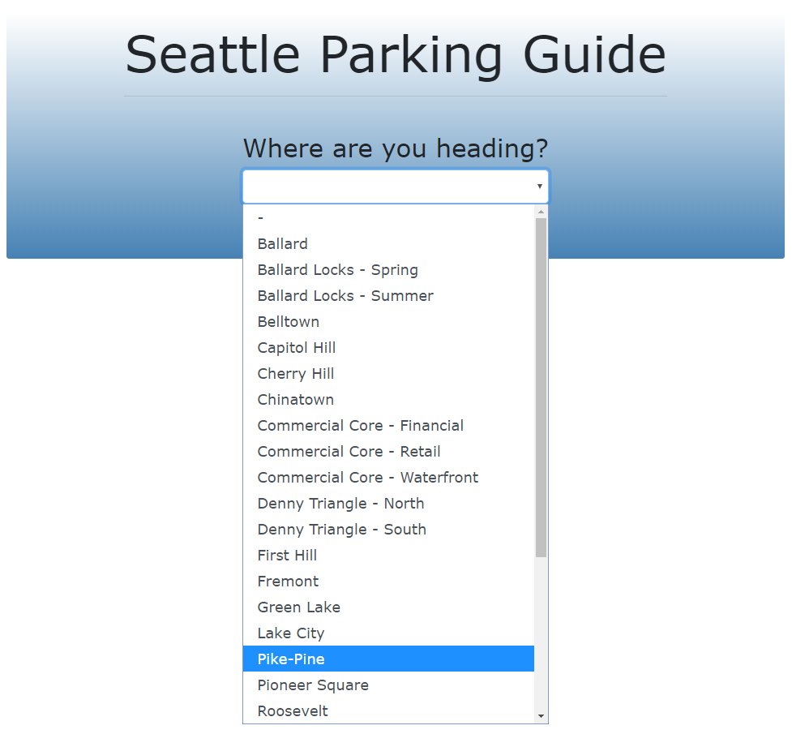
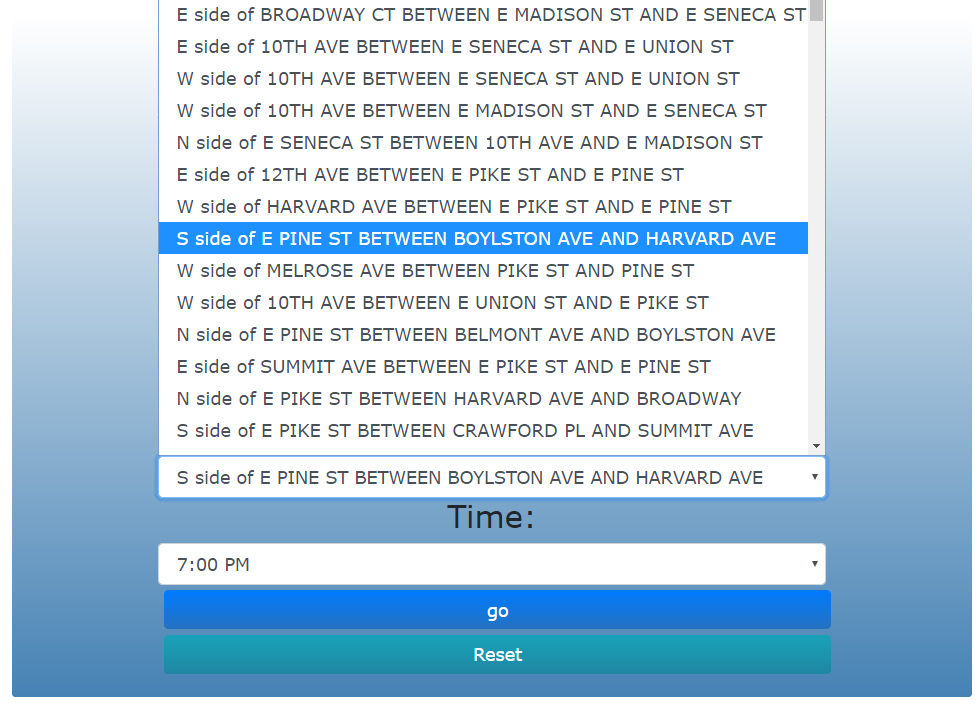
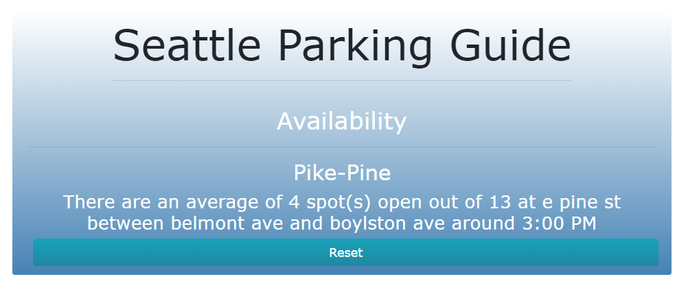

## Seattle Parking

The Seattle Parking App is a single page application developed using an Angular framework with bootstrap and written in TypeScript and Javascript. This app implements the City of Seattle’s Annual Parking Study Data API from data.gov, detailing the past year’s parking availability and usage throughout Seattle, and organized by date and time of day. It allows users to search the average hourly parking occupancy for nearly every blockface in Seattle at any given time and day of the week. 

Users are greeted with a simple input field. 

The city of Seattle is divided into smaller areas, users can look through a list for a specific area. 

Once in the area a new form is generated with a list of area for that particular region. 

In the end they are given an estimate of available spots based on the database of over 25,000 entries. 

Features we hope to implement next are a display of alternative parking options and the ability for users to “check in” in order to provide real time parking data.